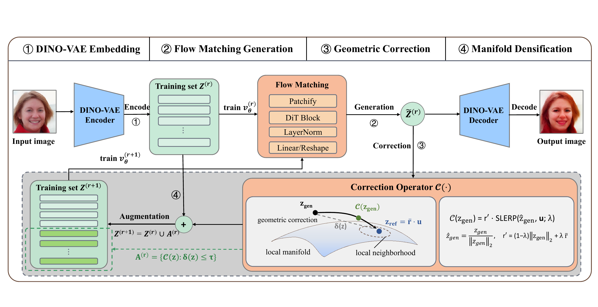

<div align="center">

# **Latent Iterative Refinement Flow: A Geometric Constrained Approach for Limited-Data Generation**.

<a href="https://arxiv.org/abs/2509.19903"></a>



</div>

## 1. Paper Overview

In the limited-data regime, diffusion/flow-matching models tend to memorize training samples.
The paper interprets this failure mode as **velocity field collapse**: the learned field degenerates into local attractors that trap sampling trajectories, reducing diversity.

LIRF (Latent Iterative Refinement Flow) addresses this from a geometric perspective:
- It trains in a semantically aligned latent space (DiNO-VAE).
- It iteratively densifies the latent manifold via a **Generation -> Correction -> Augmentation** loop.
- It uses a local contractive correction operator to pull off-manifold candidates back toward the data manifold.
- The paper provides convergence analysis and reports improved diversity/recall on FFHQ subsets and Low-Shot datasets.

## 2. Repository Contents

- `train_lirf.py`: main LIRF training script
- `models.py`, `transport/`, `augment.py`: core training components
- `scripts/make_dummy_latents.py`: creates dummy anchor latents for smoke tests

## 3. Installation

```bash
cd lirf_codebase
pip install -r requirements.txt
```

## 4. DiNO_VAE Checkpoint

For `--train-mode dino`, `train_lirf.py` uses `--vae-path Dino_VAE` by default.
Please obtain the DiNO_VAE checkpoint from ReaLS:

- Link: https://github.com/black-yt/ReaLS

Place the checkpoint directory at `lirf_codebase/Dino_VAE/`, with at least:

```text
Dino_VAE/
  config.json
  diffusion_pytorch_model.safetensors
  mean_std.json
```

## 5. Prepare Anchor Latents

By default, training loads:

```text
data/latents/train_latents_xflip_100.pt
```

This file should be a `torch.Tensor` with shape `[N, 4, H, W]`.
- For `image-size=256`, use `H=W=32`
- For `image-size=512`, use `H=W=64`

Options:

1. Use your real exported latents (recommended).
2. Run a smoke test with dummy latents:

```bash
python scripts/make_dummy_latents.py \
  --num 200 \
  --latent-size 32 \
  --out data/latents/train_latents_xflip_100.pt
```

## 6. Start Training

Note: this script requires CUDA and initializes DDP. Even for single GPU, use `torchrun`.

Multi-GPU example (8 GPUs):

```bash
torchrun --nnodes=1 --nproc_per_node=8 train_lirf.py \
  --model SiT-B/2 \
  --image-size 256 \
  --global-batch-size 64 \
  --train-mode dino \
  --vae-path Dino_VAE \
  --anchor-latents-path data/latents/train_latents_xflip_100.pt \
  --refine-every 10000 \
  --num-candidates 100 \
  --k-neighbors 3 \
  --lambda-start 0.8 \
  --lambda-end 0.2 \
  --tau 0.1 \
  --sample-every 0 \
  --max-steps 300000
```

Minimal single-GPU example:

```bash
torchrun --nnodes=1 --nproc_per_node=1 train_lirf.py \
  --model SiT-B/2 \
  --image-size 256 \
  --global-batch-size 8 \
  --train-mode dino \
  --anchor-latents-path data/latents/train_latents_xflip_100.pt \
  --sample-every 0 \
  --max-steps 1000
```

## 7. Resume Training

```bash
torchrun --nnodes=1 --nproc_per_node=8 train_lirf.py \
  --resume \
  --ckpt results/<exp_name>/checkpoints/<step>.pt \
  --max-steps 300000
```

## 8. Outputs and Logs

- Experiment directory: `results/<exp_name>/`
- Checkpoints: `results/<exp_name>/checkpoints/`
- Log file: `results/<exp_name>/log.txt`
- If `--sample-every > 0`, visualization images are saved to `results/<exp_name>/vis/`

## 9.Citation
```
@misc{li2026latentiterativerefinementflow,
      title={Latent Iterative Refinement Flow: A Geometric Constrained Approach for Few-Shot Generation}, 
      author={Songtao Li and Tianqi Hou and Zhenyu Liao and Ting Gao},
      year={2026},
      eprint={2509.19903},
      archivePrefix={arXiv},
      primaryClass={cs.LG},
      url={https://arxiv.org/abs/2509.19903}, 
}
```
